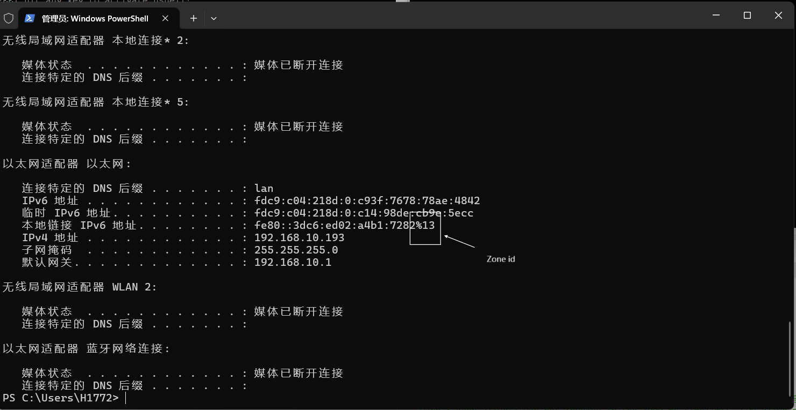
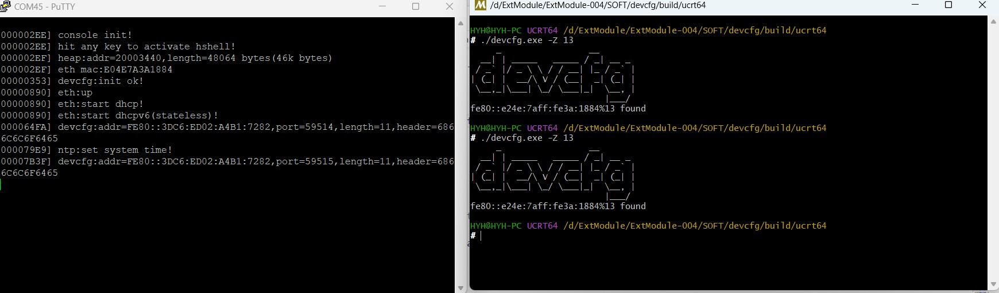

# 说明

本工具用于测试运行于以太网的设备配置服务。

本工具采用[CMake](https://www.cmake.org)作为构建系统。

现有以下功能:

- 检测设备

# IPV6 Zone

ipv6使用不同的Zone，可在地址末尾使用%连接Zone ID,本工具需要使用Zone ID作为参数。

## Windows

windows下可使用`ipconfig`获取IP信息。

# 测试

## 设备检测

